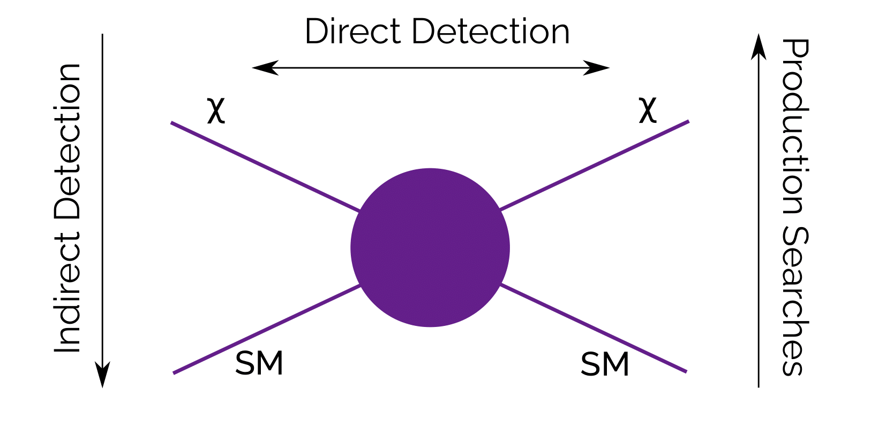
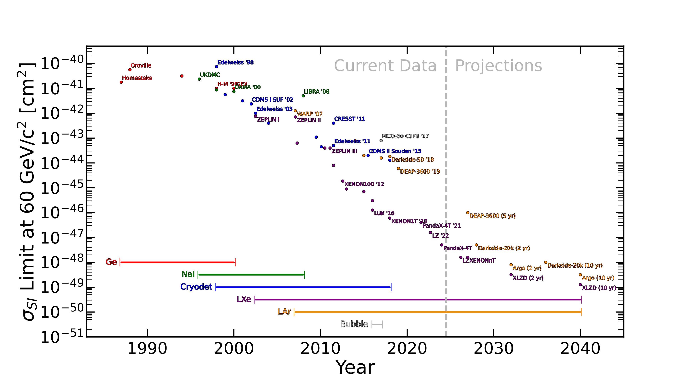

So, how do we place limits on dark matter? Well, we can 'make it', 'shake it', or 'break it'. Imagine an interaction between dark matter and regular matter, in any direction:

# Break it

Take this diagram from the bottom upwards: two standard model particles come in, two dark matter particles come out. This is how the LHC and the ATLAS experiment work: fire protons at one another, look to see if anything interesting comes out. They found the Higgs, and haven't found much since.

# Make it

Now take it from the top downwards: dark matter interacts with itself and produces standard model particles. This is how the Cern Axion Solar Telescope works, as well as some doodads on the ISS: search space for signals, and if you find more than you expect, it's dark matter.

# Shake it

Now imagine dark matter hits a SM particle and simply bounces off, dumping some energy in it in the process. We'd call this direct detection. This is where I come in.

# How's it been going?

Pretty good! We haven't *found* dark matter yet, but we can place good limits. Some of these can be funny: a paper a few years back worked out that dark matter of a high enough mass couldn't interact more than a certain amount, because if it did, we'd have seen evidence for it in hospital records. "Death and serious injury by dark matter".

Typically, we replace the human being hit by dark matter in that example with a solid material - a noble element, since it's stable. We started with Germanium, then Sodium Iodide, and now Argon and Xenon. And over the years, we've gotten more sensitive to lower cross sections (probabilities of interacting).

See the 'LZ' on there in purple? That's what I work on, and 'XLZD' is what we're working towards.