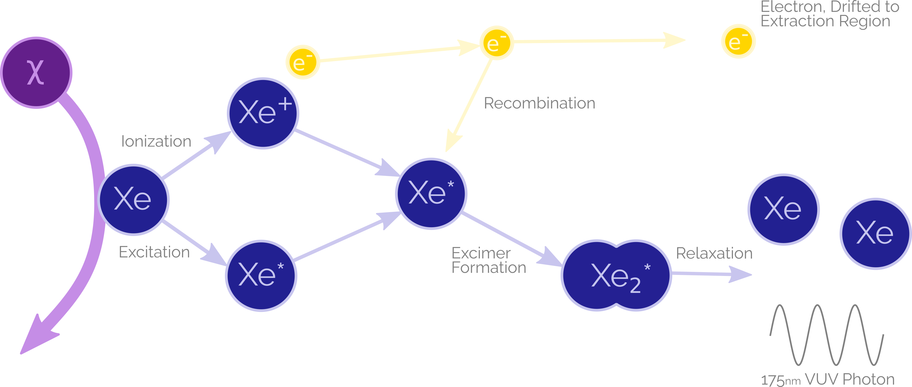
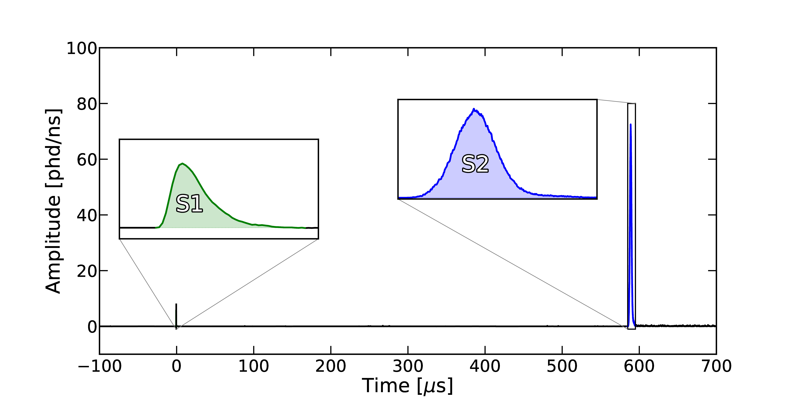
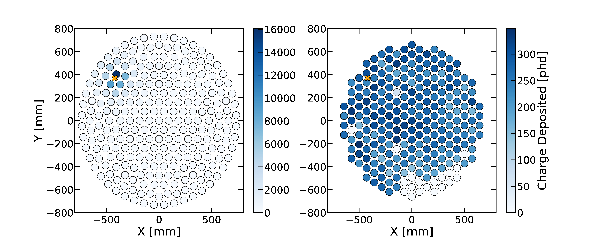
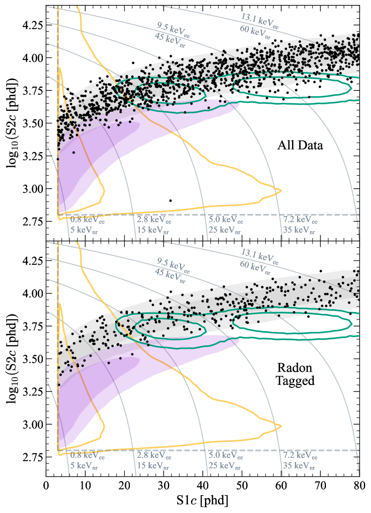
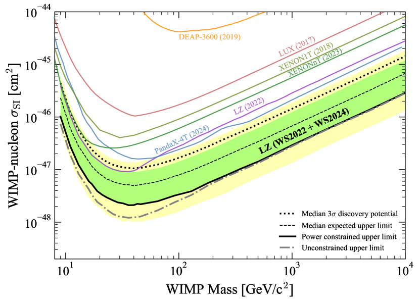

# What is LZ?

LZ, or LUX-ZEPLIN, is a second generation dual phase LXe Time Projection Chamberfor the detection of dark matter. It's located in the Sanford Underground Research Facility (SURF).

# That answered none of my questions! Those were just buzzwords!

This might help. Here's a diagram of LZ, with a person for scale. It's a matryoshka of a liquid xenon tank, inside of a skin xenon layer, inside of a GDLS tank, inside of a water tank, inside of the Davis Cavern.

# If anything, that helped even less

Most of those layers are just there to reject things that aren't dark matter, so let's ignore those and focus on the main TPC. We fill it up with LXe, and apply several voltages, seen below.

# Why?

Because if dark matter interacts with regular matter, it releases either light, heat, or electrons! The light we can pick up easily, but we have to draw the electrons towards our PMTs and make them emit light using a strong electric field.

# What do you see?

The light is immediately seen by PMTs - we call this an S1 signal. After the electrons are drawn to the TPC extraction region, they emit a lot of light too - we call this an S2. With these two signals, we can tell you a lot about an interaction!

# How?

Well, the electrons are drawn straight up, right? So the PMT on the top of the TPC with most charge collected tells you the position of the event. And the separation between the S1 and S2, the drift time, tells you about the z position - it's like how you see a firework before you hear it, and can tell how far away it is using that. Then, you can use the size of the S1 and S2 to calculate the energy of the event.

You can also work out the origin of an event, or at least guess at it. Here's a plot of data from LZ's latest science results, surviving cuts, in S1-S2 space. Interactions that bounce off of the nucleus of a Xe atom produce less charge and more light than anything bouncing off of the electrons: the electrons are further away, and so an emitted electron is less likely to be recombined with the atom. We know that dark matter wouldn't interact with electrons, were it a WIMP. So the grey band of electron recoils can be rejected from analysis, leaving just events in the purple nuclear recoil band. A few other contours, from the decay of 124Xe (green) and of random coincidence backgrounds (yellow), are included.

# So we've found dark matter?

Nope! We run a profile likelihood ratio test over our data, to assess the probability of events coming from a given mass of WIMP. This told us that the events in the purple contour are likely coincidence backgrounds and 'leakage' from the ER band. For a 40GeV/c2 WIMP, we observe a fit of 0 signal events +0.6.

But this does let us constrain dark matter - after all, if it interacted enough, we *would* have seen it. So we can repeat mockups of this analysis with simulated signals, and work out what types of dark matter we can rule out. And we can plot them here! In the 1GeV - 1TeV regime, LZ sets world-leading limits.

